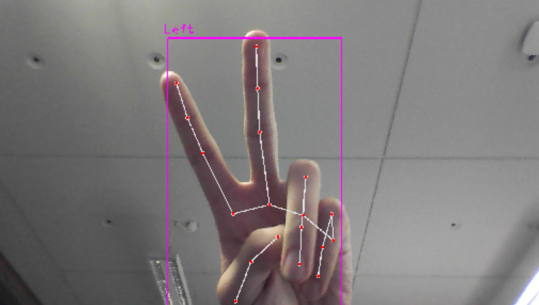

# Kuaizi Vision
Kuaizi Vision is my submission for HackNotts 2024 and was completed under a 24-hour timeframe.

  

It is a computer vision based AI that plays the chopsticks finger game against a human opponent.

# Usage
Clone the repository onto your local machine.

Ensure you pip install required dependencies:
- Numpy
- OpenCV
- Cvzone
- Pygame

You will also need to have a **webcam**

Run **python main.py** in your terminal
